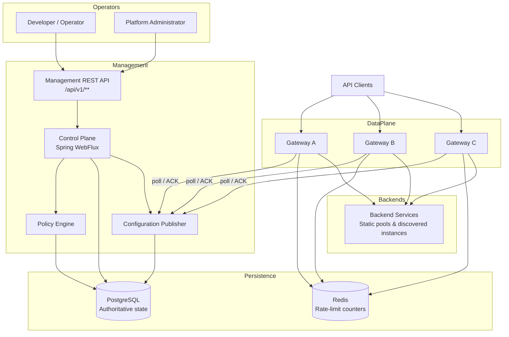
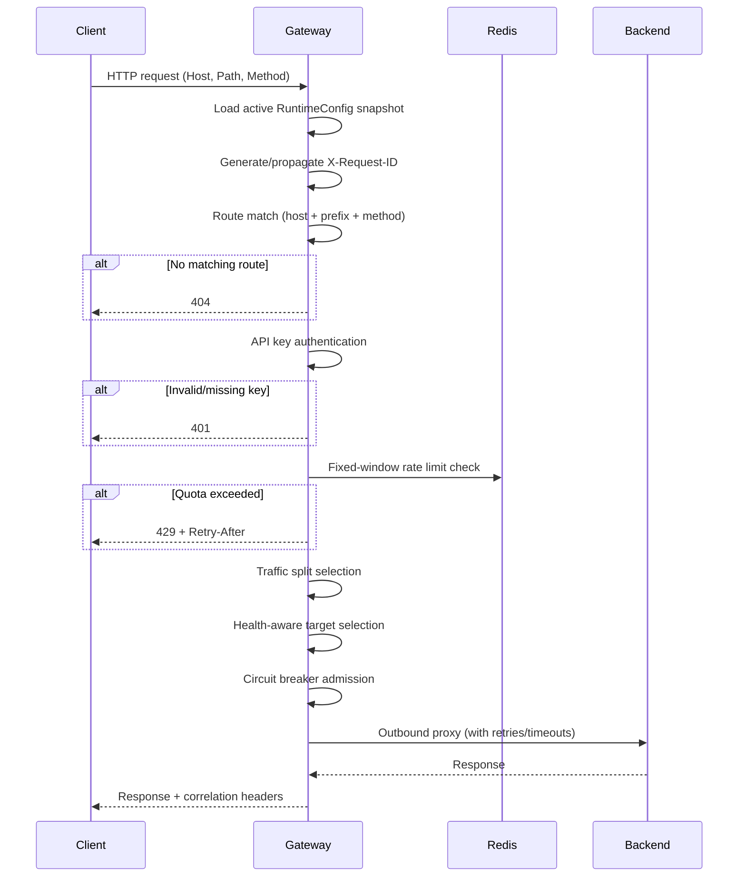
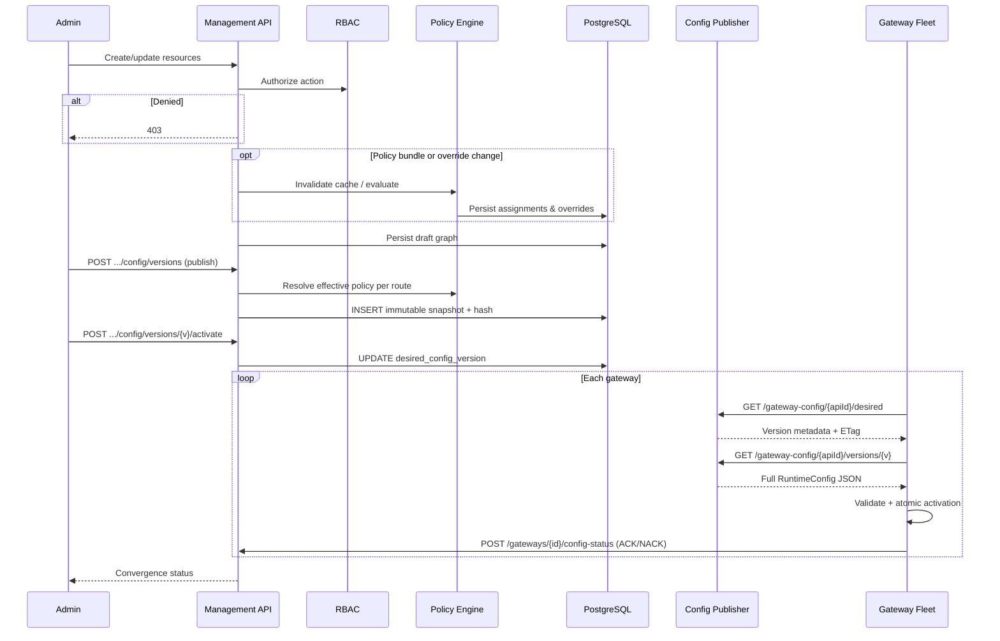

# AutoAPI

<!-- Badges: replace placeholder URLs when CI badge endpoints are configured -->


<!--  -->

**AutoAPI is a self-hosted API management platform.** Operators define APIs, routes, upstreams, and traffic policies through a management control plane. The control plane validates configuration, publishes immutable runtime snapshots, and distributes them to gateway nodes. Gateway runtimes enforce L7 policy—authentication, rate limiting, routing, retries, circuit breaking, and traffic splitting—without querying PostgreSQL on the request path.

> Distributed L7 API gateway with versioned configuration propagation, hierarchical policy inheritance, multi-gateway convergence, and cross-node rate limiting.

---

## Table of Contents

- [Why AutoAPI](#why-autoapi)
- [Feature Highlights](#feature-highlights)
- [Architecture Overview](#architecture-overview)
- [Request Flow](#request-flow)
- [Management Flow](#management-flow)
- [Policy Engine](#policy-engine)
- [Technology Stack](#technology-stack)
- [Repository Layout](#repository-layout)
- [Getting Started](#getting-started)
- [Configuration](#configuration)
- [Authentication](#authentication)
- [Database Migrations](#database-migrations)
- [Testing](#testing)
- [CI/CD](#cicd)
- [API Examples](#api-examples)
- [Screenshots](#screenshots)
- [Roadmap](#roadmap)
- [Contributing](#contributing)
- [Documentation](#documentation)
- [License](#license)

---

## Why AutoAPI

Teams running multiple API gateway instances need consistent traffic policy, safe configuration rollout, and operational visibility—not per-node ad hoc proxy settings.

AutoAPI addresses this with four cooperating layers:

| Layer | Role |
|-------|------|
| **Control Plane** | Authoritative management state, validation, compilation, and publication |
| **Configuration Publisher** | Versioned runtime snapshots with ETag polling and ACK/NACK convergence |
| **Gateway Runtime** | Nonblocking L7 reverse proxy with atomic config activation |
| **Policy Engine** | Hierarchical policy inheritance resolved at publish time |

PostgreSQL holds management state. Redis coordinates cross-gateway rate limits. Gateways serve the last acknowledged snapshot independently when the control plane is unavailable.

---

## Feature Highlights

### API Management

- Projects, APIs, upstream pools, targets, and routes
- Draft validation and deterministic compilation into immutable configuration versions
- Activation, rollback, and multi-gateway convergence reporting

### Gateway Runtime

- Host + longest path-prefix + HTTP method routing
- Nonblocking reverse proxy (Spring WebFlux / Reactor Netty)
- Atomic runtime snapshot activation (request-scoped config per request)
- Control-plane polling with `If-None-Match` / ETag support
- Gateway registration, heartbeat, and config-status ACK/NACK

### Traffic & Resilience Policies

- **Rate limiting** — Redis-backed fixed-window limits with `FAIL_OPEN` / `FAIL_CLOSED` modes
- **Retry policies** — bounded transport retries with idempotency-key enforcement
- **Circuit breakers** — per-target rolling-window failure detection with half-open recovery
- **Traffic splitting** — deterministic weighted canary routing with sticky selection keys
- **Backend health** — passive transport-failure tracking with health-aware target selection

### Platform Operations

- **Service discovery** — logical discovered services with lease heartbeats and stale reaper
- **Gateway groups** — label-based membership for scoped configuration
- **Progressive rollouts** — deterministic cohort stages with pause, resume, and rollback
- **Platform events & webhooks** — transactional outbox with signed delivery
- **Observability** — request IDs, W3C trace context, structured JSON logs, Prometheus metrics

### Security & Governance

- **Management authentication** — bearer tokens with HMAC-SHA256 digests
- **RBAC** — organization- and project-scoped roles with scoped credentials
- **API keys** — `ak_live_<keyId>.<secret>` with gateway-side O(1) validation
- **Policy engine** — hierarchical inheritance, bundles, overrides, effective-policy evaluation, explain mode

### Deployment & Tooling

- Docker multi-stage build and Docker Compose local stack
- Flyway schema migrations (V1–V13)
- GitHub Actions CI with Compose regression smokes and container validation
- Optional observability stack (`docker-compose.observability.yml`)

---

## Architecture Overview

AutoAPI ships as a single Java application (`Server/`) deployed in one of three roles via `AUTOAPI_ROLE`:

| Role | Purpose |
|------|---------|
| `control-plane` | Management APIs, config compilation, gateway coordination |
| `gateway` | Client-facing L7 proxy and policy enforcement |
| `combined` | Both planes in one process (local development) |



### Component Responsibilities

| Component | Responsibility | Hot-path dependency |
|-----------|----------------|---------------------|
| **Control Plane** | CRUD, validation, compilation, activation, convergence | None (async to gateways) |
| **Configuration Publisher** | Desired-version metadata, full snapshots, ETag polling | PostgreSQL (gateway poll only) |
| **Policy Engine** | Hierarchy resolution, bundle merge, effective policy at publish | PostgreSQL |
| **Gateway Runtime** | Route match, auth, limits, split, health, circuit breaker, proxy | Local snapshot + Redis |
| **PostgreSQL** | Projects, APIs, routes, policies, versions, gateway status, RBAC | Not on client request path |
| **Redis** | Cross-gateway fixed-window rate limiting (atomic Lua script) | Optional per policy mode |

---

## Request Flow

Every client request loads the active immutable runtime configuration once, then passes that snapshot through all enforcement stages.



Gateway pipeline order: **authentication → rate limit → traffic split → backend health → circuit breaker → retries → proxy**.

---

## Management Flow

Administrative changes flow through RBAC, optional policy evaluation, persistence, compilation, and gateway publication.



---

## Policy Engine

The policy engine (Phase 14) centralizes reusable traffic and security policy. Gateways consume **flattened** policy embedded in published runtime snapshots—they do not resolve inheritance at request time.

### Hierarchy

Policies apply at increasing specificity:

```text
Organization
  └── Project
        └── Gateway Group
              └── API
                    └── Route
```

Most-specific scope wins for override-type policies. Map-based types (`headers`, `logging`, `requestValidation`) merge across levels.

### Bundles & Revisions

1. Create a bundle at organization scope
2. Add immutable revisions with policy JSON content
3. Assign a specific revision at org, project, gateway-group, API, or route scope
4. Upgrade assignments by pinning a newer revision

### Effective Policy

| Endpoint | Purpose |
|----------|---------|
| `GET /api/v1/management/apis/{apiId}/effective-policy` | Flattened policy for an API or route |
| `GET ...?explain=true` | Include winning source metadata per policy type |
| `POST /api/v1/management/policies/evaluate` | Dry-run evaluation with optional explain |

On publish, the control plane evaluates effective policy for every route, overlays supported types onto compiled route sections, and recomputes the content hash.

### Cache Invalidation

Effective-policy results are cached in memory keyed by scope. A global generation counter invalidates all entries when bundles, assignments, overrides, or hierarchy resources change.

See [`docs/POLICY_ENGINE.md`](docs/POLICY_ENGINE.md) for merge rules, RBAC permissions, and audit events.

---

## Technology Stack

| Category | Technology | Notes |
|----------|------------|-------|
| **Language** | Java 21 | Records, pattern matching, virtual-thread-ready stack |
| **Framework** | Spring Boot 3.3, Spring WebFlux | Reactive management and gateway I/O |
| **Persistence** | PostgreSQL 16, Spring Data R2DBC + JDBC | R2DBC for reactive paths; JDBC for Flyway |
| **Caching / Coordination** | Redis 7, Spring Data Redis Reactive | Fixed-window rate limits via Lua script |
| **Migrations** | Flyway | Versioned SQL under `Server/src/main/resources/db/migration/` |
| **Serialization** | Jackson | Runtime snapshots and management API JSON |
| **Observability** | Micrometer, Prometheus, OpenTelemetry | `/actuator/prometheus`, optional OTLP export |
| **Containerization** | Docker, Docker Compose | Multi-stage JRE image; role-based deployment |
| **Build** | Gradle (Kotlin DSL) | `spotlessCheck`, `test`, `check`, `bootJar` |
| **Testing** | JUnit 5, Reactor Test, Testcontainers | PostgreSQL and Redis integration tests |
| **CI/CD** | GitHub Actions | Server CI, container build, Trivy scan, smoke validation |

---

## Repository Layout

```text
AutoAPI/
├── Server/                 # Java 21 Spring WebFlux application (control plane + gateway)
│   ├── src/main/java/com/autoapi/
│   │   ├── controlplane/   # Management APIs, compilation, policy engine, events
│   │   ├── gateway/        # Runtime proxy, rate limits, health, retries, circuits
│   │   ├── config/         # RuntimeConfig model and validation
│   │   ├── proxy/          # Upstream proxy execution
│   │   └── security/       # API key digest and validation
│   └── src/main/resources/db/migration/   # Flyway migrations V1–V13
├── deploy/config/          # Static gateway config for standalone mode
├── docker-compose.yml      # Local stack: postgres, redis, control-plane, gateways
├── scripts/                # Smoke tests and bootstrap helpers
├── tests/mock-upstream/    # Mock backend container for integration smokes
├── docs/                   # Architecture, API spec, and feature guides
└── server-old/             # Frozen legacy implementation (reference only)
```

| Path | Description |
|------|-------------|
| [`Server/`](Server/) | Active implementation — build, test, and run from here |
| [`docs/`](docs/) | Design documents and feature guides — start at [`docs/README.md`](docs/README.md) |
| [`scripts/`](scripts/) | End-to-end smoke tests (`smoke-phase*.sh`) |
| [`server-old/`](server-old/) | Legacy Node.js monolith — do not modify |

---

## Getting Started

### Prerequisites

| Requirement | Version | Used for |
|-------------|---------|----------|
| Java JDK | 21 | Local build and run |
| Docker | Current | Compose stack, Testcontainers, container smokes |
| Docker Compose | v2 | Local multi-service deployment |

### Clone and Build

```bash
git clone https://github.com/YOUR_ORG/AutoAPI.git
cd AutoAPI/Server

./gradlew --no-daemon spotlessCheck
./gradlew --no-daemon test
./gradlew --no-daemon check
./gradlew --no-daemon bootJar
```

From the repository root, `./scripts/verify-server.sh` runs the Gradle checks above and validates Compose configuration.

### Run with Docker Compose

From the repository root:

```bash
docker compose up --build
```

| Service | Port | Role |
|---------|------|------|
| `control-plane` | 8081 | Management API and config publisher |
| `gateway-a` | 8080 | Gateway data plane |
| `gateway-b` | 8082 | Gateway data plane |
| `gateway-c` | 8083 | Gateway data plane |
| `postgres` | 5432 | PostgreSQL |
| `redis` | 6379 | Redis |

### Bootstrap Management Authentication

Compose supplies development-only secrets. Initialize the platform administrator:

```bash
export AUTOAPI_BOOTSTRAP_ADMIN_TOKEN="smoke-bootstrap-token-change-me-for-local-dev-only"

curl -X POST http://localhost:8081/api/v1/management/bootstrap \
  -H "Authorization: Bearer ${AUTOAPI_BOOTSTRAP_ADMIN_TOKEN}"
```

The response includes a durable management token (`aat_<publicId>_<secret>`). Use it for subsequent management API calls. See [`docs/MANAGEMENT_AUTH.md`](docs/MANAGEMENT_AUTH.md).

### Run Smoke Tests

Smoke scripts bootstrap the stack (unless `SMOKE_SKIP_UP=true`), exercise end-to-end flows, and tear down:

```bash
./scripts/smoke-phase4.sh    # Auth + cross-gateway rate limiting
./scripts/smoke-phase5.sh    # Passive backend health
./scripts/smoke-phase6.sh    # Retry policies
./scripts/smoke-phase7.sh    # Traffic splitting
./scripts/smoke-phase10.sh   # Service discovery
./scripts/smoke-phase11.sh   # Platform events & webhooks
./scripts/smoke-phase12.sh   # Gateway groups & rollouts
./scripts/smoke-phase13.sh   # Management auth & RBAC
./scripts/smoke-phase14.sh   # Policy engine
```

Optional observability stack:

```bash
docker compose -f docker-compose.yml -f docker-compose.observability.yml up --build
./scripts/smoke-phase9.sh
```

### Example Workflow

After bootstrap, a minimal publish-and-proxy flow:

```bash
# Set MANAGEMENT_TOKEN from bootstrap response
export CONTROL_PLANE=http://localhost:8081
export AUTH="Authorization: Bearer ${MANAGEMENT_TOKEN}"

# 1. Create project and API
PROJECT_ID=$(curl -s -X POST "$CONTROL_PLANE/api/v1/projects" \
  -H "$AUTH" -H 'Content-Type: application/json' \
  -d '{"name":"demo","description":"Quick start"}' | jq -r .id)

API_ID=$(curl -s -X POST "$CONTROL_PLANE/api/v1/projects/${PROJECT_ID}/apis" \
  -H "$AUTH" -H 'Content-Type: application/json' \
  -d '{"name":"orders-api","host":"api.autoapi.local","basePath":"/"}' | jq -r .id)

# 2. Define upstream, route, publish, activate — see API Examples below
```

---

## Configuration

Key environment variables. Never commit production secrets.

| Variable | Component | Description |
|----------|-----------|-------------|
| `AUTOAPI_ROLE` | All | `control-plane`, `gateway`, or `combined` |
| `AUTOAPI_CONTROLPLANE_ENABLED` | All | Enable management APIs when `true` |
| `AUTOAPI_GATEWAY_CONFIG_SOURCE` | Gateway | `static` (file) or `control-plane` (poll) |
| `AUTOAPI_GATEWAY_ID` | Gateway | Unique gateway identifier for registration |
| `AUTOAPI_GATEWAY_API_ID` | Gateway | API to poll configuration for |
| `AUTOAPI_CONTROL_PLANE_BASE_URL` | Gateway | Control plane base URL for polling |
| `AUTOAPI_GATEWAY_POLL_INTERVAL` | Gateway | Config poll interval (default `5s`) |
| `AUTOAPI_API_KEY_PEPPER` | All | HMAC pepper for API key digests (required for auth) |
| `AUTOAPI_REDIS_URL` | Gateway | Redis URL for rate limiting |
| `SPRING_DATASOURCE_URL` | Control plane | JDBC URL for Flyway |
| `SPRING_R2DBC_URL` | Control plane | R2DBC URL for reactive persistence |
| `AUTOAPI_MANAGEMENT_TOKEN_PEPPER` | Control plane | HMAC pepper for management tokens |
| `AUTOAPI_BOOTSTRAP_ADMIN_TOKEN` | Control plane | One-time bootstrap secret |
| `AUTOAPI_WEBHOOK_SECRET_MASTER_KEY` | Control plane | Base64-encoded 32-byte webhook signing key |
| `OTEL_EXPORTER_OTLP_ENDPOINT` | Gateway | Optional OTLP trace export endpoint |

Full defaults are in [`Server/src/main/resources/application.yml`](Server/src/main/resources/application.yml).

---

## Authentication

AutoAPI uses separate credential models for management operators and API consumers.

### Management Plane

| Aspect | Behavior |
|--------|----------|
| **Bootstrap** | `POST /api/v1/management/bootstrap` with one-time `AUTOAPI_BOOTSTRAP_ADMIN_TOKEN` |
| **Tokens** | `aat_<publicId>_<secret>` bearer tokens; only HMAC digest stored |
| **RBAC** | Built-in roles at organization and project scope; scoped credentials intersect role grants |
| **Protection** | All `/api/v1/**` routes except gateway config fetch, gateway registration, and service registration |

Public exceptions include `/healthz`, `/readyz`, `/api/v1/gateway-config/**`, and gateway heartbeat/config-status endpoints.

### API Consumers (Data Plane)

| Aspect | Behavior |
|--------|----------|
| **Format** | `ak_live_<keyId>.<secret>` presented as `Authorization: Bearer` or `X-API-Key` |
| **Validation** | O(1) lookup in active runtime snapshot; HMAC-SHA256 with `AUTOAPI_API_KEY_PEPPER` |
| **Scope** | Keys are API-scoped; effective limits and splits come from route bindings in the snapshot |

See [`docs/MANAGEMENT_AUTH.md`](docs/MANAGEMENT_AUTH.md) and [`docs/PHASE13_SECURITY_REVIEW.md`](docs/PHASE13_SECURITY_REVIEW.md).

---

## Database Migrations

Schema evolution is managed by **Flyway** at application startup.

| Migration | Domain |
|-----------|--------|
| V1 | Control plane schema (projects, APIs, routes, config versions) |
| V2 | Gateway registration and status |
| V3 | API keys and rate-limit policies |
| V4 | Backend health policies |
| V5 | Retry policies |
| V6 | Traffic split policies |
| V7 | Circuit breaker policies |
| V8 | Gateway observability |
| V9 | Service discovery |
| V10 | Platform events and webhooks |
| V11 | Gateway groups and rollouts |
| V12 | Management identity and RBAC |
| V13 | Policy engine (bundles, overrides, audit) |

Migrations live in [`Server/src/main/resources/db/migration/`](Server/src/main/resources/db/migration/).

---

## Testing

| Layer | Location | Purpose |
|-------|----------|---------|
| **Unit tests** | `Server/src/test/java/` | Route matching, policy merge, hash stability, classifiers |
| **Integration tests** | `*IntegrationTest.java` | Testcontainers PostgreSQL/Redis; full management and gateway flows |
| **Smoke tests** | `scripts/smoke-phase*.sh` | End-to-end Compose regression against running containers |
| **Container startup tests** | `scripts/test-smoke-container-startup.sh` | Validates candidate Docker image boot sequence |
| **CI validation** | `.github/workflows/` | Automated Gradle checks, Compose smokes, image scan |

Integration tests require Docker for Testcontainers. The smoke scripts build images once and exercise realistic operator workflows including bootstrap, publish, activate, and proxied requests.

---

## CI/CD

Two GitHub Actions workflows validate every push and pull request that touches relevant paths.

### Server CI (`.github/workflows/server-ci.yml`)

| Job | Verifies |
|-----|----------|
| `test-and-build` | Spotless formatting, unit/integration tests, `bootJar` artifact |
| `compose-validation` | `docker compose config` syntax |
| `integration` | Phase 4, 5, 6, 7, 13, and 14 smoke scripts against Compose stack |

### Server Container (`.github/workflows/server-container.yml`)

| Job | Verifies |
|-----|----------|
| `build` | Gradle test and package |
| `container` | Docker image build, Trivy HIGH/CRITICAL scan, `smoke-container-candidate.sh` |

### Publication Policy

| Trigger | Validation | GHCR Publication |
|---------|------------|------------------|
| Push to any branch (relevant paths) | Yes | No |
| Pull request | Yes | No |
| Push to `main` | Yes | `:main` and `:sha-<short>` |
| Semantic version tag `v*.*.*` | Yes | Semver tags and `:latest` |

Image: `ghcr.io/<owner>/autoapi-server`. No cloud deployment is performed in CI.

---

## API Examples

All examples use camelCase JSON as implemented by the management API. Replace `{token}`, IDs, and hostnames for your environment.

### Create Project

```bash
curl -X POST http://localhost:8081/api/v1/projects \
  -H "Authorization: Bearer {token}" \
  -H "Content-Type: application/json" \
  -d '{
    "name": "commerce-platform",
    "description": "Production API surface"
  }'
```

```json
{
  "id": "a1b2c3d4-e5f6-7890-abcd-ef1234567890",
  "name": "commerce-platform",
  "description": "Production API surface",
  "createdAt": "2026-07-20T12:00:00Z"
}
```

### Create API

```bash
curl -X POST http://localhost:8081/api/v1/projects/{projectId}/apis \
  -H "Authorization: Bearer {token}" \
  -H "Content-Type: application/json" \
  -d '{
    "name": "orders-api",
    "host": "api.example.com",
    "basePath": "/v1"
  }'
```

### Publish Configuration

```bash
curl -X POST http://localhost:8081/api/v1/apis/{apiId}/config/versions \
  -H "Authorization: Bearer {token}"
```

```json
{
  "apiId": "b2c3d4e5-f6a7-8901-bcde-f12345678901",
  "version": 1,
  "contentHash": "sha256:abc123...",
  "createdAt": "2026-07-20T12:05:00Z"
}
```

### Activate Configuration

```bash
curl -X POST http://localhost:8081/api/v1/apis/{apiId}/config/versions/1/activate \
  -H "Authorization: Bearer {token}"
```

### Evaluate Effective Policy (Explain Mode)

```bash
curl -X POST http://localhost:8081/api/v1/management/policies/evaluate \
  -H "Authorization: Bearer {token}" \
  -H "Content-Type: application/json" \
  -d '{
    "apiId": "b2c3d4e5-f6a7-8901-bcde-f12345678901",
    "routeId": "c3d4e5f6-a7b8-9012-cdef-123456789012",
    "explain": true
  }'
```

### Assign Policy Bundle

```bash
curl -X POST http://localhost:8081/api/v1/management/organizations/00000000-0000-0000-0000-000000000001/policy-bundles/{bundleId}/assignments \
  -H "Authorization: Bearer {token}" \
  -H "Content-Type: application/json" \
  -d '{
    "revisionNumber": 1
  }'
```

The default organization ID is created by Flyway migration V12. Full endpoint reference: [`docs/API_SPEC.md`](docs/API_SPEC.md).

---

## Screenshots

<!-- Replace placeholder paths when assets are available -->

### Architecture


<!-- Add: docs/assets/architecture.png -->

### Management Dashboard


<!-- Future: operator UI for projects, APIs, and convergence -->

### Policy Evaluation


<!-- Future: effective-policy explain view -->

### Gateway Configuration


<!-- Future: gateway fleet status and ACK/NACK view -->

### CI Pipeline


<!-- Future: GitHub Actions workflow screenshot -->

---

## Roadmap

Planned capabilities not yet implemented:

| Area | Direction |
|------|-----------|
| **OpenAPI import** | Generate routes and upstream bindings from OpenAPI documents |
| **Developer portal** | Self-service API key issuance and documentation |
| **OIDC / SSO** | Federated management authentication |
| **Observability UI** | Built-in dashboards beyond Prometheus/Grafana compose |
| **WASM plugins** | Extensible request/response filters at the gateway |
| **GraphQL** | GraphQL routing and policy enforcement |
| **Kubernetes operator** | Declarative gateway fleet and config reconciliation |
| **Multi-region** | Cross-region config distribution and rate-limit federation |
| **Cloud deployment** | Terraform/CDK modules for AWS (ALB, RDS, ElastiCache) |

See [`docs/MVP_ROADMAP.md`](docs/MVP_ROADMAP.md) for the original vertical-slice plan and [`docs/PRODUCT_SPEC.md`](docs/PRODUCT_SPEC.md) for product scope.

---

## Contributing

1. Read [`docs/README.md`](docs/README.md) for architecture and design context.
2. Build and test from `Server/` — `./gradlew check` requires Docker for Testcontainers.
3. Run the relevant smoke script for your change area under `scripts/`.
4. Keep management API JSON field names consistent with existing routers (camelCase).
5. Do not modify `server-old/` — it is a frozen reference.

---

## Documentation

| Document | Contents |
|----------|----------|
| [`docs/README.md`](docs/README.md) | Documentation index and reading order |
| [`docs/ARCHITECTURE.md`](docs/ARCHITECTURE.md) | System design and request-path rationale |
| [`docs/API_SPEC.md`](docs/API_SPEC.md) | Management REST API reference |
| [`docs/POLICY_ENGINE.md`](docs/POLICY_ENGINE.md) | Hierarchy, bundles, effective policy |
| [`docs/MANAGEMENT_AUTH.md`](docs/MANAGEMENT_AUTH.md) | Bootstrap, tokens, RBAC |
| [`docs/SERVICE_DISCOVERY.md`](docs/SERVICE_DISCOVERY.md) | Dynamic backend membership |
| [`docs/ROLLOUTS.md`](docs/ROLLOUTS.md) | Gateway groups and progressive rollouts |
| [`docs/EVENTS.md`](docs/EVENTS.md) | Platform events and webhooks |
| [`docs/OBSERVABILITY.md`](docs/OBSERVABILITY.md) | Metrics, tracing, structured logs |
| [`Server/README.md`](Server/README.md) | Build commands and gateway pipeline details |

> **Note:** Some design documents (`docs/ARCHITECTURE.md`, `docs/PRODUCT_SPEC.md`) describe the original FastAPI/Go target architecture. The **implemented platform** is Java 21 / Spring WebFlux in `Server/`. Behavior and APIs match the docs; language choices differ.

---

## License

No license file is present in this repository yet. Add a `LICENSE` file before public distribution.
